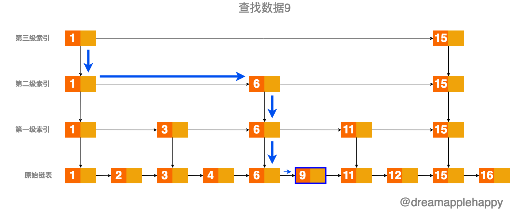

# 使用JavaScript实现SkipList这种数据结构

代码的实现参考了。。。

## 前言

## SkipList的具体实现
首先我们先粗略的看一下JavaScript版本的代码，具体如下所示：
```javascript
```
如果你看完上面的代码，感觉还是没有太明白；也不要着急，下面我会仔细的讲解一下上面代码的思路

首先，我们定义了一个`Node`类；这个类生成的实例有三个属性，分别是`data`，`maxLevel`和`refer`；
具体的解释可以看代码里面的注释；这里要注意的是`refer`这个属性，它是一个长度为`MAX_LEVEL`的数组，
数组里面的值是一个指向别的节点的索引。可以大概看下面这张图来加深一下理解：


不知道上面的图大家有没有看得更明白一点，如果没有的话，也没有关系；我们先继续往下面走。

接下来，我们又定义了一个SkipList类，这个类就是我们要实现的跳表类；SkipList的实例属性有`levelCount`和`head`
关于这两个属性的解释可以看代码里面的注释；

我们先来看一下`randomLevel`这个类的静态方法，这个方法用来生成一个不大于`MAX_LEVEL`的值；这个值
可以在我们向SkipList添加元素的时候，生成一个随机的索引级数；**这个随机函数这样设计的原因是为了保证
我们在向SkipList添加元素的时候，每一级索引节点的数量大概能够是上一级索引节点的2倍。**

我们首先来看一下SkipList的`find`方法，如果这个方法你能够理解的话，那么SkipList的`remove`和`insert`
方法你都能够快速的理解；我们来试一试吧。

首先我们把整个链表的头指针赋值给`p`(这里你可能会有疑问，为什么`this.head`就是整个链表的头指针；这个我们会在后面
讲解`insert`方法的时候再给大家讲解一下)。然后是两层循环，外层是一个`for`循环，里面是一个`while`循环；
我们这个时候就可以看下面这张图了：



首先我们需要知道的是，`for`循环是从SkipList的顶层索引开始循环，方向是从上到下的；`while`循环则是从某一层的索引开始，
然后从左到右循环；当然我们说的从上到下和从左到右，都是对照我们上面的那张图来进行说明的。

假设我们的SkipList是上面的那张图表示的那样，我们现在需要查找数值9；我们应该怎么做呢？看一下我们的代码，
我们首先从顶层开始遍历，看上面的图我们知道这个时候SkipList的`levelCount`应该是`4`，因为我们是从`0`开始计算索引的级数(**第0级索引也就是我们的原始链表**)，
所以最顶层的索引的级数应该是`levelCount - 1`也就是`3`，然后我们就进入了一个`while`循环，这个`while`循环的终止条件是：
**当前节点在本层级的下一个节点(我们用`p1`表示)不为空(undefined)，并且`p1`的`data`值要小于我们所找的数值**，
我们用`l`表示当前索引的计数，用`p`表示当前遍历到的节点(或者可以理解为一个指针)，
那么当`l=3`的时候，第一次`while`循环，`p.refer[3]`表示的是第三级索引的`Node(1)`，因为满足`while`的循环条件，
我们又进行一次操作，`p = p.refer[i]`，这表明我们此时遍历到了`Node(1)`，或者说是当前的指针指向了`Node(1)`;
然后我们准备进行下一次循环，但是`p.refer[i] !== undefined && p.refer[i].data < value`这个表达式的值不为真；
因为此时`p`表示的是`Node(1)`，`p.refer[i]`表示的是`Node(15)`，因为`p.refer[i].data`大于`9`，所以内部的`while`循环终止。
此时外层的`for`循环让`i`变为了`2`，然后`p.refer[i]`表示的是第二级索引上面的`Node(1)`，满足`while`循环，然后继续进行，
这里就不在继续描述程序的运行了，我们可以知道，当`p`表示的是第0级索引的`Node(6)`的时候，所有的循环都已经结束。
然后我们还需要进行一次判断，那就是我们当前位置的下一个节点是不是我们需要找的值(为什么还需要判断？因为我们循环的条件是当前节点
的下一个节点的`data`值要小于我们查找的`value`，如果循环结束，那说明当前节点的下一个节点的值大于或者等于`value`值，所以还需要进行以此判断)。
如果是的话，就返回`p.refer[i]`，如果不是就返回一个`null`。


然后我们准备


## 运算的时间


